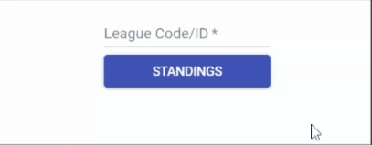

#Football Standings

A SPA that displays current standings with the squads for the passed league built with React and Redux, with test cases using jest-enzyme.

This sample app cosumes the [football-data](https://www.football-data.org/) API. 
*Make sure to get your own API key*

### Running Code

In the project directory, you can run:

### `yarn start`

Runs the app in the development mode. 
Open [http://localhost:3000](http://localhost:3000) to view it in the browser.

The page will reload if you make edits. 
You will also see any lint errors in the console.

## Usage

- Enter a valid competition code
  - Here are some ones:
    - 2013 / BSA (Brazil - Série A)
    - 2002 / BL1 (Germany - Bundesliga)
    - 2014 / PD (Spain - Primera Division)
    - 2021 / PL (England - Premier League)

- Wait for the server respose and check the current season standings

### `yarn test` - Using Jest and Enzyme

Launches the test runner in the interactive watch mode. 
See the section about [running tests](https://facebook.github.io/create-react-app/docs/running-tests) for more information.
